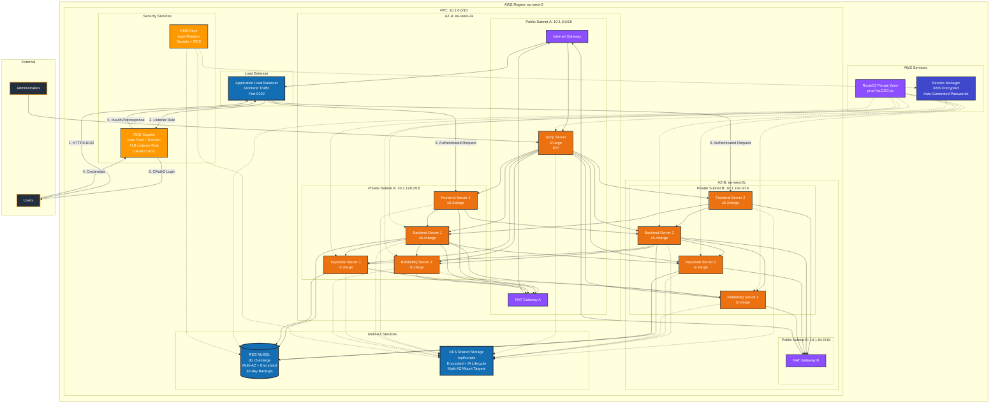

# CSO High Availability Architecture

```mermaid
graph TB
    subgraph "AWS Region: eu-west-2"
        subgraph "VPC: 10.1.0.0/16"
            subgraph "AZ-A: eu-west-2a"
                subgraph "Public Subnet A: 10.1.0.0/18"
                    IGW[Internet Gateway]
                    JS[Jump Server<br/>t2.large<br/>EIP]
                    NAT1[NAT Gateway A]
                end
                
                subgraph "Private Subnet A: 10.1.128.0/18"
                    FE1[Frontend Server 1<br/>c5.2xlarge]
                    BE1[Backend Server 1<br/>c5.4xlarge]
                    KS1[Keystone Server 1<br/>t2.xlarge]
                    RMQ1[RabbitMQ Server 1<br/>t2.xlarge]
                end
            end
            
            subgraph "AZ-B: eu-west-2c"
                subgraph "Public Subnet B: 10.1.64.0/18"
                    NAT2[NAT Gateway B]
                end
                
                subgraph "Private Subnet B: 10.1.192.0/18"
                    FE2[Frontend Server 2<br/>c5.2xlarge]
                    BE2[Backend Server 2<br/>c5.4xlarge]
                    KS2[Keystone Server 2<br/>t2.xlarge]
                    RMQ2[RabbitMQ Server 2<br/>t2.xlarge]
                end
            end
            
            subgraph "Load Balancer"
                ALB[Application Load Balancer<br/>Frontend Traffic<br/>Port 8102]
            end
            
            subgraph "Multi-AZ Services"
                RDS[(RDS MySQL<br/>db.c5.4xlarge<br/>Multi-AZ + Encrypted<br/>30-day Backups)]
                EFS[EFS Shared Storage<br/>/opt/scripts<br/>Encrypted + IA Lifecycle<br/>Multi-AZ Mount Targets]
            end
            
            subgraph "Security Services"
                KMS[KMS Keys<br/>Auto-Rotation<br/>Secrets + RDS]
                COGNITO[AWS Cognito<br/>User Pool + Domain<br/>ALB Listener Rule<br/>OAuth2 OIDC]
            end
        end
        
        subgraph "AWS Services"
            SM[Secrets Manager<br/>KMS Encrypted<br/>Auto-Generated Passwords]
            R53[Route53 Private Zone<br/>prod-ha.CSO.ss]
        end
    end
    
    subgraph "External"
        USER[Users]
        ADMIN[Administrators]
    end
    
    %% Load Balancer with Cognito Authentication
    USER -->|"1. HTTPS:8102"| ALB
    ALB -->|"2. Listener Rule"| COGNITO
    COGNITO -->|"3. OAuth2 Login"| USER
    USER -->|"4. Credentials"| COGNITO
    COGNITO -->|"5. /oauth2/idpresponse"| ALB
    ALB -->|"6. Authenticated Request"| FE1
    ALB -->|"6. Authenticated Request"| FE2
    
    %% Admin Access
    ADMIN --> JS
    JS --> FE1
    JS --> FE2
    JS --> BE1
    JS --> BE2
    JS --> KS1
    JS --> KS2
    JS --> RMQ1
    JS --> RMQ2
    
    %% Application Connections
    FE1 --> BE1
    FE1 --> BE2
    FE2 --> BE1
    FE2 --> BE2
    
    BE1 --> KS1
    BE1 --> KS2
    BE2 --> KS1
    BE2 --> KS2
    
    BE1 --> RMQ1
    BE1 --> RMQ2
    BE2 --> RMQ1
    BE2 --> RMQ2
    
    %% Database Connections
    BE1 --> RDS
    BE2 --> RDS
    KS1 --> RDS
    KS2 --> RDS
    
    %% RabbitMQ Clustering
    RMQ1 -.-> RMQ2
    
    %% Network flows
    IGW --> JS
    IGW --> ALB
    NAT1 --> IGW
    NAT2 --> IGW
    FE1 --> NAT1
    BE1 --> NAT1
    KS1 --> NAT1
    RMQ1 --> NAT1
    FE2 --> NAT2
    BE2 --> NAT2
    KS2 --> NAT2
    RMQ2 --> NAT2
    
    %% Shared storage (Multi-AZ)
    JS -.-> EFS
    FE1 -.-> EFS
    FE2 -.-> EFS
    BE1 -.-> EFS
    BE2 -.-> EFS
    KS1 -.-> EFS
    KS2 -.-> EFS
    RMQ1 -.-> EFS
    RMQ2 -.-> EFS
    
    %% DNS Resolution
    R53 -.-> BE1
    R53 -.-> BE2
    R53 -.-> KS1
    R53 -.-> KS2
    R53 -.-> RMQ1
    R53 -.-> RMQ2
    R53 -.-> RDS
    
    %% Secrets and Security
    SM -.-> JS
    KMS -.-> SM
    KMS -.-> RDS
    KMS -.-> EFS
    
    classDef aws fill:#ff9900,stroke:#232f3e,stroke-width:2px,color:#fff
    classDef compute fill:#ec7211,stroke:#232f3e,stroke-width:2px,color:#fff
    classDef storage fill:#3f48cc,stroke:#232f3e,stroke-width:2px,color:#fff
    classDef network fill:#8c4fff,stroke:#232f3e,stroke-width:2px,color:#fff
    classDef external fill:#232f3e,stroke:#ff9900,stroke-width:2px,color:#fff
    classDef ha fill:#146eb4,stroke:#232f3e,stroke-width:3px,color:#fff
    
    class IGW,NAT1,NAT2,R53,ALB network
    class JS,FE1,FE2,BE1,BE2,KS1,KS2,RMQ1,RMQ2 compute
    class RDS,EFS,SM storage
    class USER,ADMIN external
    class ALB,RDS,EFS ha
    class KMS,COGNITO aws
```