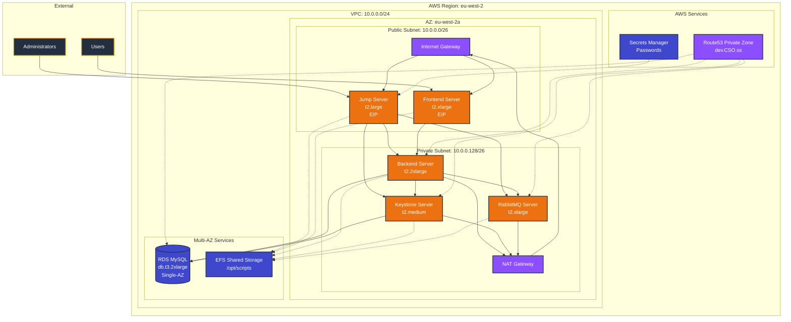

# CSO Single-Node Architecture

```mermaid
graph TB
    subgraph "AWS Region: eu-west-2"
        subgraph "VPC: 10.0.0.0/24"
            subgraph "AZ: eu-west-2a"
                subgraph "Public Subnet: 10.0.0.0/26"
                    IGW[Internet Gateway]
                    JS[Jump Server<br/>t2.large<br/>EIP]
                    FE[Frontend Server<br/>t2.xlarge<br/>EIP]
                end
                
                subgraph "Private Subnet: 10.0.0.128/26"
                    NAT[NAT Gateway]
                    BE[Backend Server<br/>t2.2xlarge]
                    KS[Keystone Server<br/>t2.medium]
                    RMQ[RabbitMQ Server<br/>t2.xlarge]
                end
            end
            
            subgraph "Multi-AZ Services"
                RDS[(RDS MySQL<br/>db.t3.2xlarge<br/>Single-AZ)]
                EFS[EFS Shared Storage<br/>/opt/scripts]
            end
        end
        
        subgraph "AWS Services"
            SM[Secrets Manager<br/>Passwords]
            R53[Route53 Private Zone<br/>dev.CSO.ss]
        end
    end
    
    subgraph "External"
        USER[Users]
        ADMIN[Administrators]
    end
    
    %% Connections
    USER --> FE
    ADMIN --> JS
    JS --> BE
    JS --> KS
    JS --> RMQ
    FE --> BE
    BE --> KS
    BE --> RMQ
    BE --> RDS
    KS --> RDS
    
    %% Network flows
    IGW --> JS
    IGW --> FE
    NAT --> IGW
    BE --> NAT
    KS --> NAT
    RMQ --> NAT
    
    %% Shared storage
    JS -.-> EFS
    FE -.-> EFS
    BE -.-> EFS
    KS -.-> EFS
    RMQ -.-> EFS
    
    %% DNS
    R53 -.-> BE
    R53 -.-> KS
    R53 -.-> RMQ
    R53 -.-> RDS
    
    %% Secrets
    SM -.-> JS
    
    classDef aws fill:#ff9900,stroke:#232f3e,stroke-width:2px,color:#fff
    classDef compute fill:#ec7211,stroke:#232f3e,stroke-width:2px,color:#fff
    classDef storage fill:#3f48cc,stroke:#232f3e,stroke-width:2px,color:#fff
    classDef network fill:#8c4fff,stroke:#232f3e,stroke-width:2px,color:#fff
    classDef external fill:#232f3e,stroke:#ff9900,stroke-width:2px,color:#fff
    
    class IGW,NAT,R53 network
    class JS,FE,BE,KS,RMQ compute
    class RDS,EFS,SM storage
    class USER,ADMIN external
```