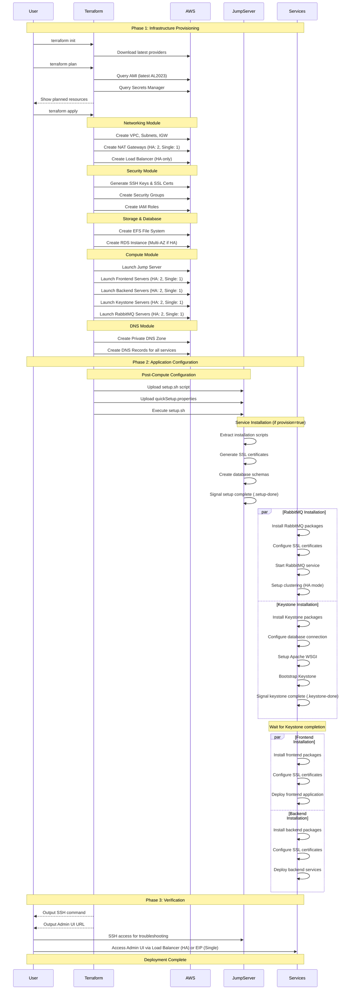

# CSO Deployment Flow

```mermaid
sequenceDiagram
    participant User
    participant Terraform
    participant AWS
    participant JumpServer
    participant Services
    
    Note over User,Services: Phase 1: Infrastructure Provisioning
    
    User->>Terraform: terraform init
    Terraform->>AWS: Download latest providers
    
    User->>Terraform: terraform plan
    Terraform->>AWS: Query AMI (latest AL2023)
    Terraform->>AWS: Query Secrets Manager
    Terraform-->>User: Show planned resources
    
    User->>Terraform: terraform apply
    
    Note over Terraform,AWS: Networking Module
    Terraform->>AWS: Create VPC, Subnets, IGW
    Terraform->>AWS: Create NAT Gateways (HA: 2, Single: 1)
    Terraform->>AWS: Create Load Balancer (HA only)
    
    Note over Terraform,AWS: Security Module
    Terraform->>AWS: Generate SSH Keys & SSL Certs
    Terraform->>AWS: Create Security Groups
    Terraform->>AWS: Create IAM Roles
    
    Note over Terraform,AWS: Storage & Database
    Terraform->>AWS: Create EFS File System
    Terraform->>AWS: Create RDS Instance (Multi-AZ if HA)
    
    Note over Terraform,AWS: Compute Module
    Terraform->>AWS: Launch Jump Server
    Terraform->>AWS: Launch Frontend Servers (HA: 2, Single: 1)
    Terraform->>AWS: Launch Backend Servers (HA: 2, Single: 1)
    Terraform->>AWS: Launch Keystone Servers (HA: 2, Single: 1)
    Terraform->>AWS: Launch RabbitMQ Servers (HA: 2, Single: 1)
    
    Note over Terraform,AWS: DNS Module
    Terraform->>AWS: Create Private DNS Zone
    Terraform->>AWS: Create DNS Records for all services
    
    Note over User,Services: Phase 2: Application Configuration
    
    Note over Terraform,JumpServer: Post-Compute Configuration
    Terraform->>JumpServer: Upload setup.sh script
    Terraform->>JumpServer: Upload quickSetup.properties
    Terraform->>JumpServer: Execute setup.sh
    
    Note over JumpServer,Services: Service Installation (if provision=true)
    
    JumpServer->>JumpServer: Extract installation scripts
    JumpServer->>JumpServer: Generate SSL certificates
    JumpServer->>JumpServer: Create database schemas
    JumpServer->>JumpServer: Signal setup complete (.setup-done)
    
    par RabbitMQ Installation
        Services->>Services: Install RabbitMQ packages
        Services->>Services: Configure SSL certificates
        Services->>Services: Start RabbitMQ service
        Services->>Services: Setup clustering (HA mode)
    and Keystone Installation
        Services->>Services: Install Keystone packages
        Services->>Services: Configure database connection
        Services->>Services: Setup Apache WSGI
        Services->>Services: Bootstrap Keystone
        Services->>Services: Signal keystone complete (.keystone-done)
    end
    
    Note over Services: Wait for Keystone completion
    
    par Frontend Installation
        Services->>Services: Install frontend packages
        Services->>Services: Configure SSL certificates
        Services->>Services: Deploy frontend application
    and Backend Installation
        Services->>Services: Install backend packages
        Services->>Services: Configure SSL certificates
        Services->>Services: Deploy backend services
    end
    
    Note over User,Services: Phase 3: Verification
    
    Terraform-->>User: Output SSH command
    Terraform-->>User: Output Admin UI URL
    
    User->>JumpServer: SSH access for troubleshooting
    User->>Services: Access Admin UI via Load Balancer (HA) or EIP (Single)
    
    Note over User,Services: Deployment Complete
```