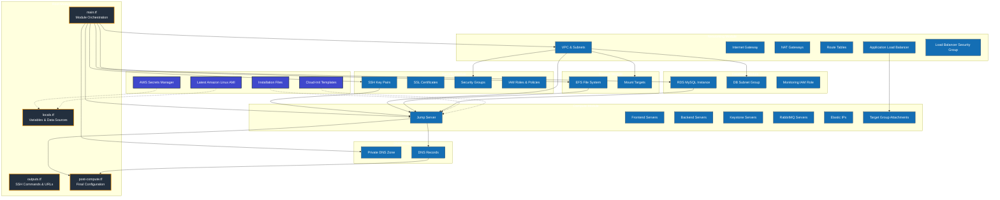

# Terraform Module Architecture

```mermaid
graph TB
    subgraph "Root Module"
        MAIN[main.tf<br/>Module Orchestration]
        LOCALS[locals.tf<br/>Variables & Data Sources]
        OUTPUTS[outputs.tf<br/>SSH Commands & URLs]
        POST[post-compute.tf<br/>Final Configuration]
    end
    
    subgraph "Networking Module"
        NET_VPC[VPC & Subnets]
        NET_IGW[Internet Gateway]
        NET_NAT[NAT Gateways]
        NET_RT[Route Tables]
        NET_ALB[Application Load Balancer]
        NET_SG_LB[Load Balancer Security Group]
    end
    
    subgraph "Security Module"
        SEC_KEYS[SSH Key Pairs]
        SEC_SSL[SSL Certificates]
        SEC_SG[Security Groups]
        SEC_IAM[IAM Roles & Policies]
    end
    
    subgraph "Storage Module"
        STOR_EFS[EFS File System]
        STOR_MT[Mount Targets]
    end
    
    subgraph "Database Module"
        DB_RDS[RDS MySQL Instance]
        DB_SG[DB Subnet Group]
        DB_IAM[Monitoring IAM Role]
    end
    
    subgraph "Compute Module"
        COMP_JUMP[Jump Server]
        COMP_FE[Frontend Servers]
        COMP_BE[Backend Servers]
        COMP_KS[Keystone Servers]
        COMP_RMQ[RabbitMQ Servers]
        COMP_EIP[Elastic IPs]
        COMP_TG[Target Group Attachments]
    end
    
    subgraph "DNS Module"
        DNS_ZONE[Private DNS Zone]
        DNS_RECORDS[DNS Records]
    end
    
    subgraph "External Dependencies"
        AWS_SM[AWS Secrets Manager]
        AWS_AMI[Latest Amazon Linux AMI]
        FILES[Installation Files]
        TEMPLATES[Cloud-Init Templates]
    end
    
    %% Module Dependencies
    MAIN --> NET_VPC
    MAIN --> SEC_KEYS
    MAIN --> STOR_EFS
    MAIN --> DB_RDS
    MAIN --> COMP_JUMP
    MAIN --> DNS_ZONE
    
    %% Inter-module Dependencies
    SEC_KEYS --> COMP_JUMP
    NET_VPC --> SEC_SG
    NET_VPC --> STOR_MT
    NET_VPC --> DB_SG
    NET_VPC --> COMP_JUMP
    NET_ALB --> COMP_TG
    STOR_EFS --> COMP_JUMP
    DB_RDS --> COMP_JUMP
    COMP_JUMP --> DNS_RECORDS
    
    %% External Dependencies
    AWS_SM -.-> LOCALS
    AWS_AMI -.-> LOCALS
    FILES -.-> COMP_JUMP
    TEMPLATES -.-> COMP_JUMP
    
    %% Post-compute Dependencies
    COMP_JUMP --> POST
    DNS_RECORDS --> POST
    
    classDef root fill:#232f3e,stroke:#ff9900,stroke-width:2px,color:#fff
    classDef module fill:#ec7211,stroke:#232f3e,stroke-width:2px,color:#fff
    classDef resource fill:#146eb4,stroke:#232f3e,stroke-width:1px,color:#fff
    classDef external fill:#3f48cc,stroke:#232f3e,stroke-width:2px,color:#fff
    
    class MAIN,LOCALS,OUTPUTS,POST root
    class NET_VPC,NET_IGW,NET_NAT,NET_RT,NET_ALB,NET_SG_LB,SEC_KEYS,SEC_SSL,SEC_SG,SEC_IAM,STOR_EFS,STOR_MT,DB_RDS,DB_SG,DB_IAM,COMP_JUMP,COMP_FE,COMP_BE,COMP_KS,COMP_RMQ,COMP_EIP,COMP_TG,DNS_ZONE,DNS_RECORDS resource
    class AWS_SM,AWS_AMI,FILES,TEMPLATES external
```